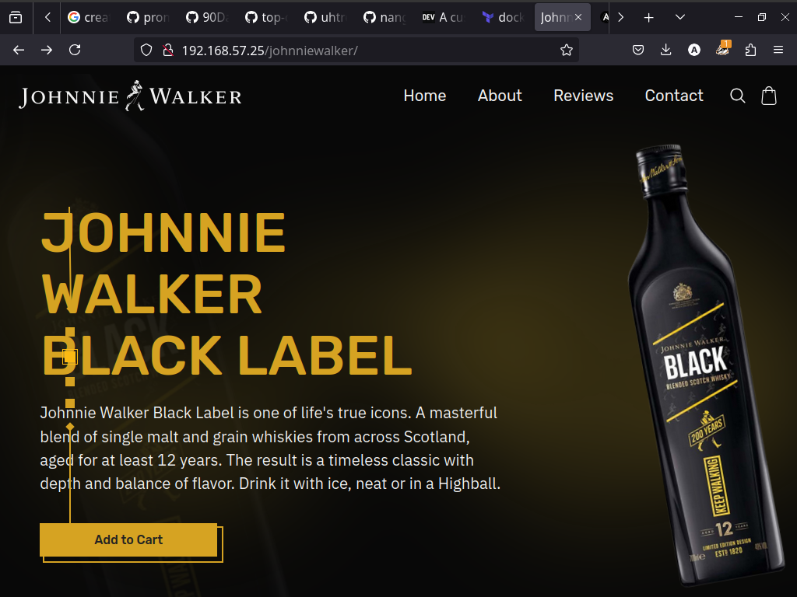

# Deploy of a website using NGINX locally

## Introduction

In this project, there is the deploy of a website, owned by [Helder Cambuta](https://github.com/nangazaki) locally, using NGINX on a Vagrant machine, automatically, using shell script

## Archtecture

In this project there is a one VM, created using Vagrant, called:

*Nginx

## Usage

### Pre-requisites

To use this project, you need:

1. Install [Vagrant](https://developer.hashicorp.com/vagrant/install?product_intent=vagrant)

2. Install [VirtualBox](https://www.virtualbox.org/wiki/Downloads)

### Execution

To setup the enviroment use:

`vagrant up`

After setup the enviroment, to provisioning the machine use:

`vagrant provision`

Access the machine using the command:

`vagrant ssh`

Or type in your browser the URL:

`http://192.168.57.25/johnniewalker/`

### Screenshot

<figure>

<figcaption>Application deployed</figcaption>
</figure>
